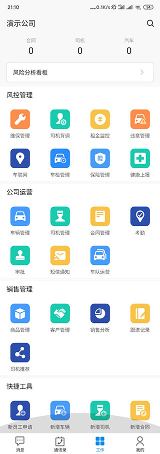
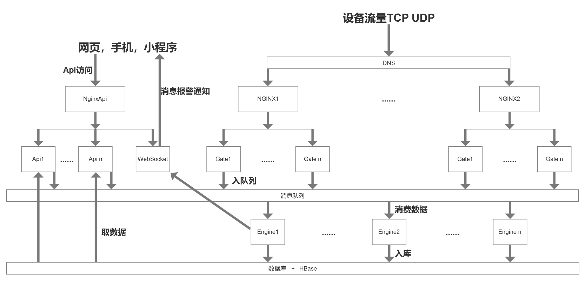
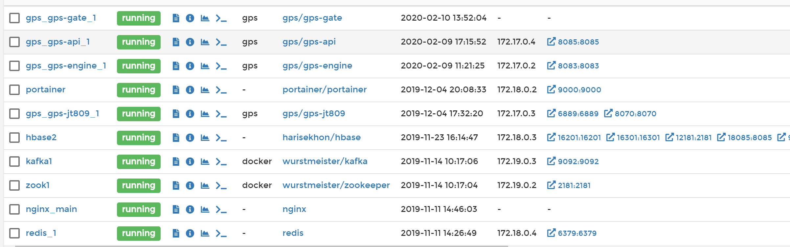
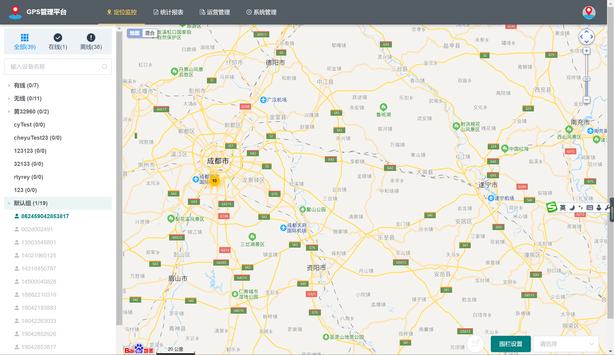
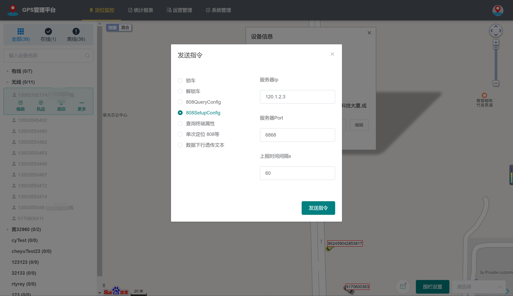
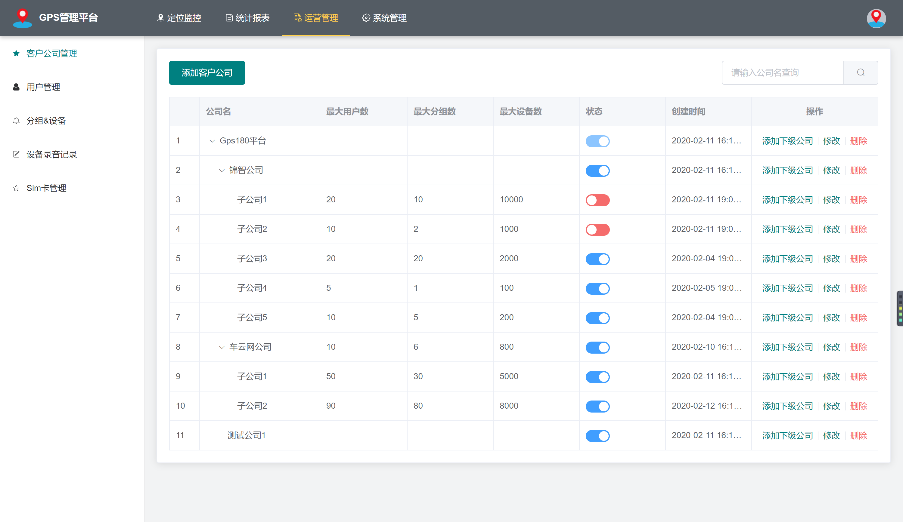
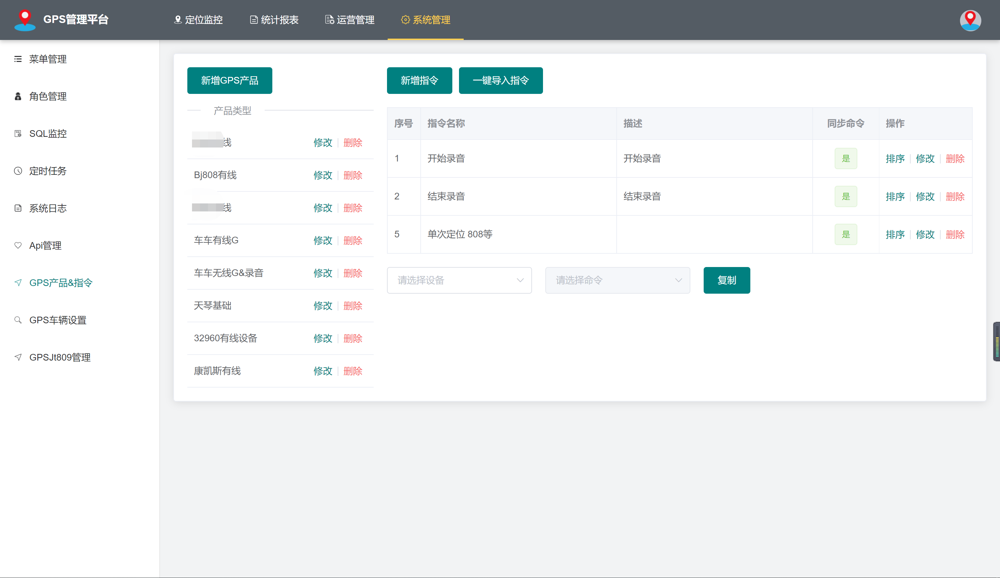

# GPS180 服务器平台

该项目为前后端分离项目，前端项目地址：[`gps180-vue`](https://gitee.com/wibim/gps180-vue)。

## 联系QQ群：1053077770

## 项目介绍

`gps180`一个在Spring Boot2. X上开发Gps平台，使用Spring Boot、Shiro、MyBatis、Redis、Bootstrap、Vue2.x等框架，包括：Gps的一般监控，围栏，报警，命令，SIM，数据分析，2压点，子帐号，精准权限等Gps平台功能；还包含：公司管理、用户管理、角色管理、分组管理、菜单管理、定时任务、参数管理、代码生成器、日志管理、Druid监控、API模块、前后端分离等。

### 项目演示

**演示地址：**
- [http://wibim.vicp.net:8089/](http://wibim.vicp.net:8089/)

**账号密码：**

- 超级管理员：`testadmin/123456`

- 公司管理员：`testadmin2/123456`

- 设备登录：`13503548801/1133`

**设备连接地址与端口：**

- wibim.vicp.net : 6868

**支持协议：**

- jt808、天琴、博实结、康凯斯、谷米、32960

### 本项目源商用管车SaaS演示

**电脑端：** [https://biz.ccwcar.com/](https://biz.ccwcar.com/)

**纯GPS端** [https://gps.ccwcar.com/](https://gps.ccwcar.com/)

**手机端：** 




自己注册帐号后加入演示公司，公司编号`290383`，申请加入后联系qq群

----------------------------------------------------------------------------------
### 系统架构图




### 技术选型
| 技术 | 描述|
|---|--- |
| [Spring Boot](https://spring.io/projects/spring-boot) | 核心框架 |
| [Apache Shiro](http://shiro.apache.org)  | 安全框架 |
| [MyBatis plus](https://mp.baomidou.com/) | ORM框架 |
| [Druid](https://github.com/alibaba/druid/wiki/%E5%B8%B8%E8%A7%81%E9%97%AE%E9%A2%98) | 数据连接池 |
| [Redis](https://redis.io) | 缓存数据库 |
| [Swagger-UI](	https://github.com/swagger-api/swagger-ui) | Api文档生产工具 |
| [JWT](https://github.com/jwtk/jjwt) | JWT登录支持 |
| [Netty](https://netty.io/) | 设备tcp udp连接 |
| [Lombok](	https://github.com/rzwitserloot/lombok) | 简化对象封装工具 |
| [Gradle](https://gradle.org/) | 项目管理 |
| [Docker](https://www.docker.com/) | 应用容器引擎 |

###  系统功能
- 公司管理：可配置系统组织架构，树形表格展示，给下级子公司开帐号用
- 用户管理：提供用户的相关配置，开下级公司后，加一个帐号才能登录
- 角色管理：对权限与菜单进行分配，可设置帐号的数据权限，精细化管理
- 菜单管理：已实现菜单动态路由，后端可配置化，支持多级菜单
- 操作日志：记录用户操作的日志
- SQL监控：采用druid 监控数据库访问性能，默认用户名admin，密码123456
- 定时任务：整合Quartz做定时任务，加入任务日志，任务运行情况一目了然
- 代码生成：高灵活度一键生成前后端代码，减少百分之80左右的工作任务
- API文档：用swagger-ui显示api接口，方便二次开发
- GPS监控：主页显示用户能看到的所有设备位置，分在线，离线，在线设备可实时显示
- GPS跟踪：跟踪后，能查看设备的行驶路径
- GPS报警：实时监控报警消息，在电脑端提示
- GPS事件：实时监控事件消息，在电脑端提示
- GPS围栏：提供围栏设置，可画圆和多边形。可绑定GPS设备到围栏，进出围栏都会实时通知到电脑端，主页可显示某个围栏，方便监控
- GPS报表：提供报警分析，位置分析，行程分析，停留点分析多个功能
- GPS分组：提供分组管理，分组里可以加多个设备，分组在主页体现
- GPS录音：支持可录音的设备，上传到数据库保存，下载成amr文件后，可以监听
- GPS卡管理：如果可以对接SIM卡接口，这里可以二次开发对接
- GPS命令：提供50多种设备的命令，添加和下发都非常方便
- 809平台对接：可以作为上级，下级平台对接到其它部标平台

### 项目结构
``` lua
├─gps180
├── gps-api -- 给前端或将来的APP提供的API接口模块
├── gps-common -- lib 公共模块
├── gps-db -- lib 公共数据库操作模块
├── gps-gbt32960 -- lib 32960电动车国标协议解析模块
├── gps-gennerator -- 代码生成器，二次开发用
├── gps-jt809 -- 部标809协议（服务器转发）模块
├── gps-websocket -- lib 为前端或APP提供实时数据更新
├── hbase -- lib HBase存储（大数据方案）操作模块
├── gps-gate -- gps设备数据接收和协议解析模块
├── gps-engine -- gps数据处理和分发模块
```
### 最新1.0更新内容如下(更新日期2020.02.15)
- 数据权限升级。
- 前端产品更加易用，更加简洁，大气。
- 修改众多已知问题。
- 增加测试权限和测试用户。
- 解决设备登录和用户登录冲突问题。

### 项目特点
- 基于SpringBoot，使用最新技术栈，社区资源丰富。
- 实现前后端分离，通过token进行数据交互，前端再也不用关注后端技术
- 完善的日志记录体系，可记录登录日志，业务操作日志。
- 项目按功能模块化，提升开发，测试效率。
- 高效率开发，使用代码生成器可以一键生成前后端代码。
- 灵活的权限控制，可控制到页面或按钮，满足绝大部分的权限需求。
- 防止XSS攻击，对所有的输入的非法字符串进行过滤以及替换。
- 引入quartz定时任务，可动态完成任务的添加、修改、删除、暂停、恢复及日志查看等功能。
- 引入swagger文档支持，方便编写API接口文档。
- 应用netty作为长连接工具，一台服务器支持10万+台设备连接。
- 用大数据方案存gps轨迹数据。

### 部分截图





## 许可证

[Apache License 2.0](https://gitee.com/wibim/gps180/blob/master/LICENSEE)

## ccw开源项目

官网：https://www.ccwcar.com/